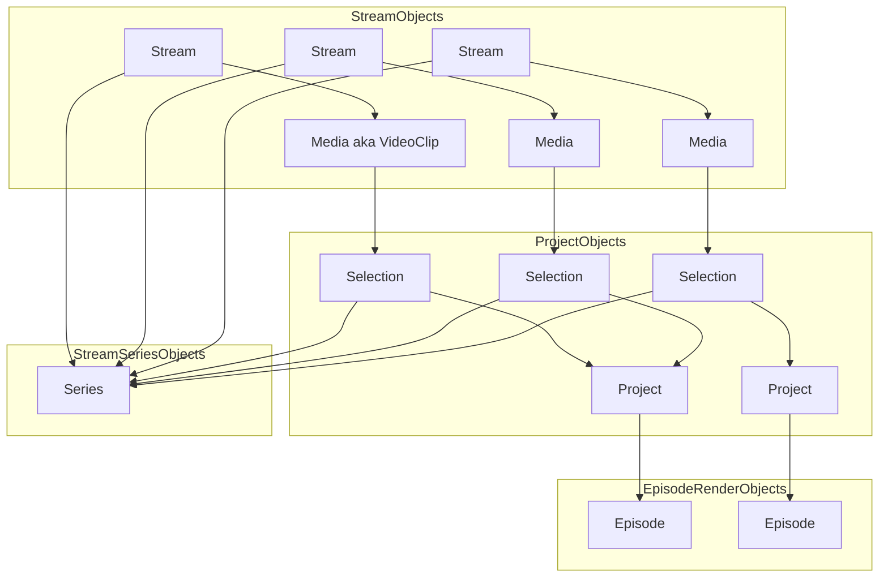

## 🧩 Entity Relationships & Workflow

```mermaid
graph TD
    subgraph StreamObjects
        Stream1[Stream]
        Stream2[Stream]
        Stream3[Stream]
        Media1[Media aka VideoClip]
        Media2[Media]
        Media3[Media]
        Stream1 --> Media1
        Stream2 --> Media2
        Stream3 --> Media3
    end

    subgraph ProjectObjects
        Selection1[Selection]
        Selection2[Selection]
        Selection3[Selection]
        Project1[Project]
        Project2[Project]
        Media1 --> Selection1 --> Project1
        Media2 --> Selection2 --> Project1
        Media3 --> Selection3 --> Project2
    end

    subgraph EpisodeRenderObjects
        Episode1[Episode]
        Episode2[Episode]
        Project1 --> Episode1
        Project2 --> Episode2
    end

    subgraph StreamSeriesObjects
        Series[Series]
        Stream1 --> Series
        Stream2 --> Series
        Stream3 --> Series
        Selection1 --> Series
        Selection2 --> Series
        Selection3 --> Series
    end

```